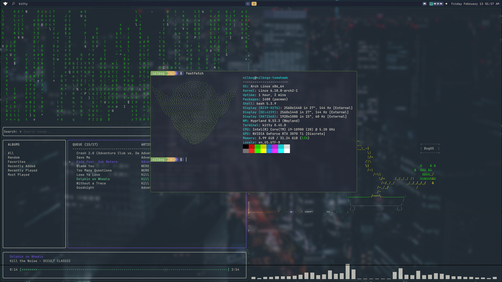
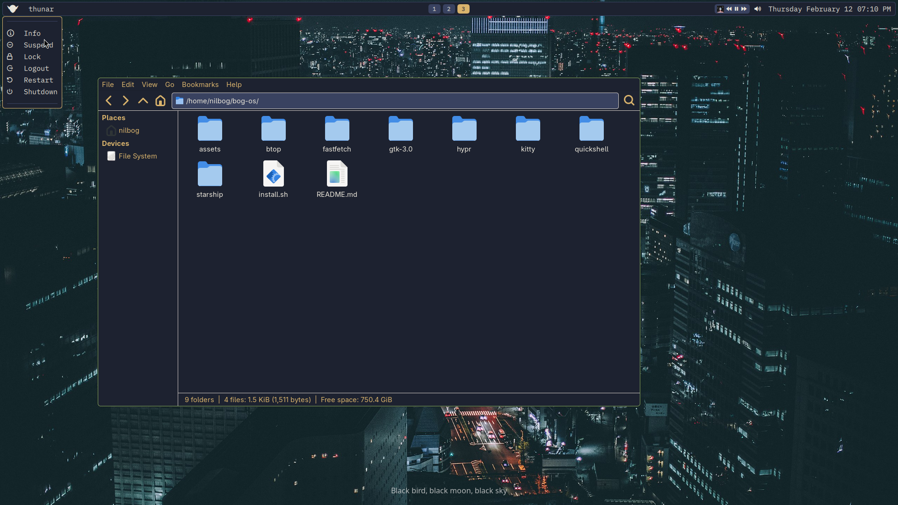

# BogOS

## Customization and Info

### Colors

|Type          |Hex Code |Color Name     |
| ------------ | ------- | ------------- |
|primary       |#80a961  |bog-os green   |
|secondary     |#394260  |slate blue     |
|background    |#1D2230  |charcoal black |
|foreground    |#EAE6DA  |bone white     |
|accent1       |#D9B36C  |goblin gold    |
|accent2       |#7E6BC4  |fen purple     |

## Programs and Tools

### Desktop and OS

**Hyprland** - Hyprland is used for the WM  
**Hyprlauncher** - A launcher part of the *Hypr* ecosystem (Soon to be replaced with custom launcher)
**Hyprpaper** - Wallpaper manager  
**Hyprlock** - Display lockscreen  

**[Quickshell](https://github.com/NILBOGtheSavior/bog-os_quickshell)**:

- Toolbar
- System menu
- Control panel
- Notification daemon

**Starship** - Shell prompt customization  

### Applications

**neovim** - Terminal based text editor  
**kitty** - Terminal emulator  
**btop** - Resource monitor  

